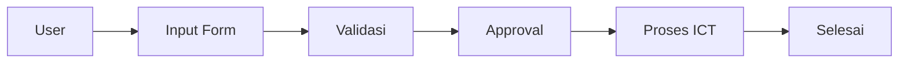

# Flow System

```text
User Unit -> Isi Form -> Draft tersimpan localStorage -> Submit
Submit -> Validasi Request -> Simpan ke DB -> Masuk antrian approval/proses ICT
Approval -> ICT Process -> Update status -> Selesai / ditindaklanjuti
```

## Approval Email
```text
Pemohon -> Atasan langsung -> HRGA -> ICT -> Akun aktif
```

## CCTV Down
```text
Operator timbang cek CCTV -> CCTV OFF/tidak merekam -> Proses timbang dihentikan
-> Buat Berita Acara -> Lapor ICT -> Perbaikan -> Timbang dilanjutkan setelah normal
```

## Diagram Mermaid

